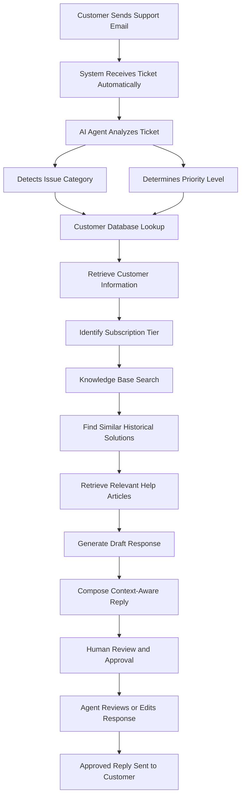

# The Problem We're Solving

Companies receive hundreds or even thousands of customer support requests every day. These requests include issues such as password resets, billing disputes, account access problems, service outages, and feature-related questions.

In a traditional support workflow, a human agent must manually:

- Read and understand the customer request
- Identify the issue category
- Determine the urgency level
- Search customer records
- Look through previous support documentation
- Draft a response
- Send the reply back to the customer

A large percentage of these tickets are repetitive and follow predictable resolution patterns. As ticket volume grows, response times increase, operational costs rise, and support teams become overloaded.

Our goal is to automate the repetitive parts of the support workflow while still keeping humans involved in the final approval process.

---

# How the AI Support Agent Works

